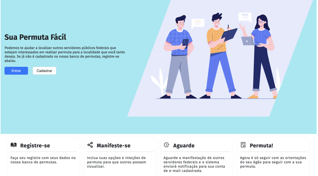

<h1 style="display: flex; aling-itens: center; justify-content: center; gap: 10px">
    
PermutaGov</h1>

<h1 align="center">
    
</h1>
--
<p align="center">
 <a href="#-sobre-o-projeto">Sobre</a> •
 <a href="#-funcionalidades">Funcionalidades</a> •
 <a href="#-como-executar-o-projeto">Como executar</a> • 
 <a href="#-tecnologias">Tecnologias</a> • 
 <a href="#-contribuidores">Contribuidores</a> • 
</p>

## 💻 Sobre o projeto

**PermutaGov** - é uma forma de conectar servidores públicos federais com interesses comum em movimentação no território nacional por meio do sistema de permuta.

Projeto desenvolvido para conclusão de curso durante a **Bootcamp em Desenvolvimento Web FullStack** oferecida pela [Enap](https://www.enap.gov.br/pt/) em parceria com a [Ironhack](https://www.ironhack.com/en).

---

## ⚙️ Funcionalidades

- [x] O servidor público federal se cadastrar na plataforma web informando:

  - [x] Nome
  - [x] CPF
  - [x] E-mail
  - [x] Órgão ao qual está vinculado
  - [x] Unidade administrativa
  - [x] Senha para acesso:

- [x] Os usuários cadastrado têm acesso à aplicação Web, onde podem:
  - [x] Incluir uma ou mais unidades administrativas na localidade para onde deseja efetivar a permuta;
  - [x] Consultar unidades de origem disponíveis, isto é, aqueles em que outros servidores manifestaram-se intenção de permutar;
  - [x] Consultar o histórico de suas manifestações;
  - [x] Excluir aquelas manifestações das quais não tem mais interesse;
  - [x] Editar seu perfil de usuário, alterando seu orgão administrativo de origem;

---

## 🚀 Como executar o projeto

Este projeto é divido em 2 (duas) partes:

1. [Frontend](https://github.com/atejap05/BootCamp-Dev-Web-MERN-APP-Frontend)
2. [Backend](https://github.com/atejap05/BootCamp-Dev-Web-MERN-APP-Backend)

💡O Frontend precisa que o Backend esteja sendo executado para funcionar, conforme orientações abaixo.

### Pré-requisitos

Antes de começar, você vai precisar ter instalado em sua máquina as seguintes ferramentas:
[Git](https://git-scm.com), [Node.js](https://nodejs.org/en/).
Além disto é bom ter um editor para trabalhar com o código como [VSCode](https://code.visualstudio.com/)

#### 🎲 Rodando o Backend (servidor)

```bash

# Clone este repositório
$ git clone https://github.com/atejap05/BootCamp-Dev-Web-MERN-APP-Backend.git

# Acesse a pasta do projeto no terminal/cmd
$ cd BootCamp-Dev-Web-MERN-APP-Backend

# Instale as dependências
$ npm install

# Execute a aplicação em modo de desenvolvimento
$ npm startDev

# O servidor inciará na porta:8080 - acesse http://localhost:8080

```

#### 🧭 Rodando a aplicação web (Frontend)

```bash

# Clone este repositório
$ git clone https://github.com/atejap05/BootCamp-Dev-Web-MERN-APP-Frontend.git

# Acesse a pasta do projeto no seu terminal/cmd
$ cd BootCamp-Dev-Web-MERN-APP-Frontend

# Instale as dependências
$ npm install

# Execute a aplicação em modo de desenvolvimento
$ npm run start

# Execute Sass
$ npm run watch:sass

# A aplicação será aberta na porta:3000 - acesse http://localhost:3000

```

---

## 🛠 Tecnologias

As seguintes ferramentas foram usadas na construção do projeto:

#### **Website** ([React](https://reactjs.org/))

- **[React Router Dom](https://github.com/ReactTraining/react-router/tree/master/packages/react-router-dom)**
- **[React Icons](https://react-icons.github.io/react-icons/)**
- **[Axios](https://github.com/axios/axios)**
- **[Node-Sass](https://github.com/sass/node-sass)**
- **[Atnd Design 5.0](https://ant.design/)**

> Veja o arquivo [package.json](https://github.com/atejap05/BootCamp-Dev-Web-MERN-APP-Frontend/blob/main/package.json)

#### [Backend](https://github.com/tgmarinho/Ecoleta#server-nodejs--typescript) ([NodeJS](https://nodejs.org/en/))

- **[Express](https://expressjs.com/)**
- **[CORS](https://expressjs.com/en/resources/middleware/cors.html)**
- **[Mongoose](https://mongoosejs.com/)**
- **[MongoDB](https://account.mongodb.com/)**
- **[Bcrypt](https://github.com/kelektiv/node.bcrypt.js#readme)**
- **[dotENV](https://github.com/motdotla/dotenv)**
- **[Multer](https://github.com/expressjs/multer)**
- **[JWT](https://jwt.io/)**
- **[Nodemailer](https://nodemailer.com/about/)**
- **[Swagger](https://swagger.io/)**

> ## Veja o arquivo [package.json](https://github.com/atejap05/BootCamp-Dev-Web-MERN-APP-Backend/blob/main/package.json)

## 👨‍💻 Contribuidores

Desenvolvedores Full Stack que levaram a ideia do papel para o mundo Web em menos de 2 semanas. 👏👏👏

<table>
  <tr>
    <td align="center"><a href="https://github.com/atejap05"><br /><sub><b>Joel Alves</b></sub></a><br /><a href="https://github.com/atejap05" title="Joel">👨‍🚀</a></td>
    <td align="center"><a href="https://github.com/julianohcosta"><br /><sub><b>Juliano Hausen</b></sub></a><br /><a href="https://github.com/julianohcosta" title="Juliano">👨‍🚀</a></td>
    <td align="center"><a href="https://github.com/dcladeira"><br /><sub><b>Daniel Ladeira</b></sub></a><br /><a href="https://github.com/dcladeira" title="Daniel">👨‍🚀</a></td>
    <td align="center"><a href="https://github.com/murilodsd"><br /><sub><b>Claudio Orlandi</b></sub></a><br /><a href="https://github.com/murilodsd" title="Murilo">👨‍🚀</a></td>
